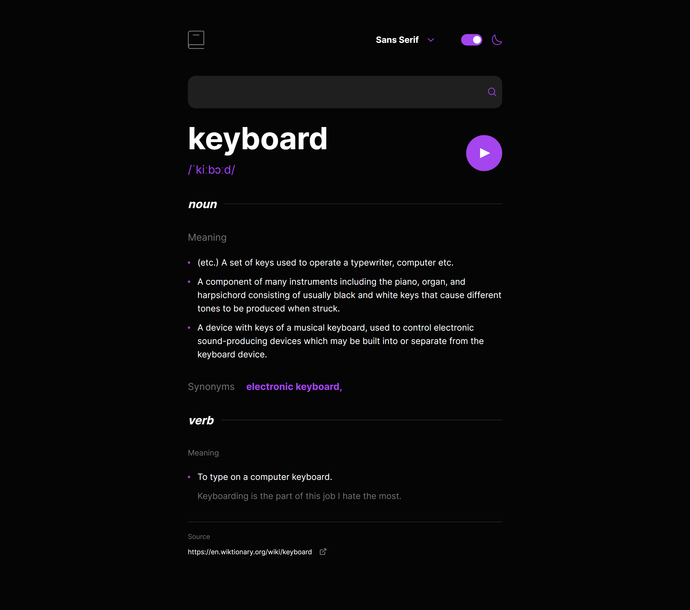

# Frontend Mentor - Dictionary web app solution

This is a solution to the [Dictionary web app challenge on Frontend Mentor](https://www.frontendmentor.io/challenges/dictionary-web-app-h5wwnyuKFL). Frontend Mentor challenges help you improve your coding skills by building realistic projects. 

## Table of contents

- [Overview](#overview)
  - [The challenge](#the-challenge)
  - [Screenshot](#screenshot)
  - [Links](#links)
- [My process](#my-process)
  - [Built with](#built-with)
  - [What I learned](#what-i-learned)
  - [Continued development](#continued-development)
  - [Useful resources](#useful-resources)
- [Author](#author)


## Overview

### The challenge

Users are able to:

- Search for words using the input field
- See the Free Dictionary API's response for the searched word
- See a form validation message when trying to submit a blank form
- Play the audio file for a word when it's available
- Switch between serif, sans serif, and monospace fonts
- Switch between light and dark themes
- View the optimal layout for the interface depending on their device's screen size
- See hover and focus states for all interactive elements on the page
- **Bonus**: Have the correct color scheme chosen for them based on their computer preferences. _Hint_: Research `prefers-color-scheme` in CSS.

### Screenshot




### Links


### to be added
- Solution URL: [Add solution URL here](https://your-solution-url.com)
- Live Site URL: [https://one-word-dictionary.netlify.app](https://one-word-dictionary.netlify.app)

## My process

### Built with

- Semantic HTML5 markup
- Flexbox
- CSS Grid
- Mobile-first workflow
- [TailwindCSS](https://tailwindcss.com) - CSS Utility class library
- [React](https://reactjs.org) - JS Component library
- [Vite](https://vitejs.dev) - Project setup/templating and compiler
- [SASS](https://sass-lang.com) - CSS extension language 
- [Axios](https://axios-http.com) - HTTP Library

### What I learned

This was a good practice project for me as it got me building things that I havn't built in a while. The main piece of functionality was the theme toggle.

Although I have built this fucntionality before in previous projects, I hadn't, until now, built it with local storage, checking the users operating system for their personal preference, using tailwind and doing this inside of react. This is the first time doing all these things in one project and it was fun trying to come up with a solution that made all of these things work, and this is something I will be including in a future project.


### Here is my "useTheme" hook I used to create the theme toggle functionality, while also using tailwind. 
```js
const useTheme = () => {
  const [htmlDoc, setHtmlDoc] = useState(document.documentElement);
  const [useDark, setUseDark] = useState(
    window.matchMedia("(prefers-color-scheme: dark)").matches
  );
  //
  const handleThemeSelectChange = () => {
    htmlDoc.classList.toggle("light");
    htmlDoc.classList.toggle("dark");
    if (htmlDoc.classList.contains("light")) {
      localStorage.setItem("theme", "light");
    }
    if (htmlDoc.classList.contains("dark")) {
      localStorage.setItem("theme", "dark");
    }
  };
  // Handles change based on users preference
  const handleThemeChange = (isDarkMode) => {
    if (isDarkMode) {
      htmlDoc.classList.add("dark");
      htmlDoc.classList.remove("light");
    }
    if (!isDarkMode) {
      htmlDoc.classList.add("light");
      htmlDoc.classList.remove("dark");
    }
  };
  // On inital load, check if in local storage or set by preference
  const checkIfThemeStored = () => {
    htmlDoc.className = "light";
    if (localStorage.getItem("theme")) {
      const theme = localStorage.getItem("theme");
      htmlDoc.className = theme;
    }
    if (!localStorage.getItem("theme")) {
      // handles change on inital preference
      handleThemeChange(useDark);
    }
  };
  //
  useEffect(() => {
    checkIfThemeStored();
  }, []);
  //
  useEffect(() => {
    const mediaQuery = window.matchMedia("(prefers-color-scheme: dark)");
    //
    const handleChange = (e) => {
      setUseDark(e.matches);
    };
    //
    mediaQuery.addEventListener("change", handleChange);
    return () => {
      mediaQuery.removeEventListener("change", handleChange);
    };
  }, []);
  //
  return {
    htmlDoc,
    handleThemeSelectChange
  };
};

export default useTheme;
```

### Here is the theme toggle component to go with it
```js
 const ThemeSelect = () => {
  const { htmlDoc, handleThemeSelectChange } = useTheme();
  const { isThemeToggled, setIsThemeToggled } = useGlobal();
  //
  useEffect(() => {
    if (htmlDoc.classList.contains("light")){
      setIsThemeToggled(false)
    }
    if (htmlDoc.classList.contains("dark")){
      setIsThemeToggled(true)
    }
  }, [htmlDoc])
  //
  return (
    <div className="flex justify-center items-center gap-3 tab:gap-5">
      <div
        className={`w-11 h-6 rounded-xl relative hover:cursor-pointer ${
          isThemeToggled ? "bg-purple" : "bg-lightGray"
        }`}
        onClick={() => {
          setIsThemeToggled(!isThemeToggled);
          handleThemeSelectChange()
        }}
      >
        <div
          className={`absolute top-1/2 left-0 transition-all -translate-y-1/2  w-4 h-4 bg-white rounded-full ${
            isThemeToggled ? "translate-x-[25px]" : "translate-x-[3px]"
          }`}
        ></div>
      </div>
      <MoonIcon
        className={`${isThemeToggled ? "stroke-purple" : "stroke-lightGray"}`}
      />
    </div>
  );
};

export default ThemeSelect;
```


### Continued development

This was the first time in a long time I've had to play an audio file in an application, and the first time in a react application! So this has made want to build some sort of music app in the near future, maybe something using the spotify APIs which could be an exciting idea for a project to build in the future.

### Useful resources

- [Article on geeksforgeeks about using an audio toggle in react](https://www.geeksforgeeks.org/how-to-toggle-play-pause-in-reactjs-with-audio/) - This was the first time I've had to play an audio file in react and this article was helpful to me when setting up playing audio on the button click functionality.


## Author

- Portfolio - [www.djhdevelopment.com](https://www.djhwebdevelopment.com)
- Frontend Mentor - [@David-Henery4](https://www.frontendmentor.io/profile/yourusername)
- LinkedIn - [David Henery](https://www.linkedin.com/in/david-henery-725458241)


